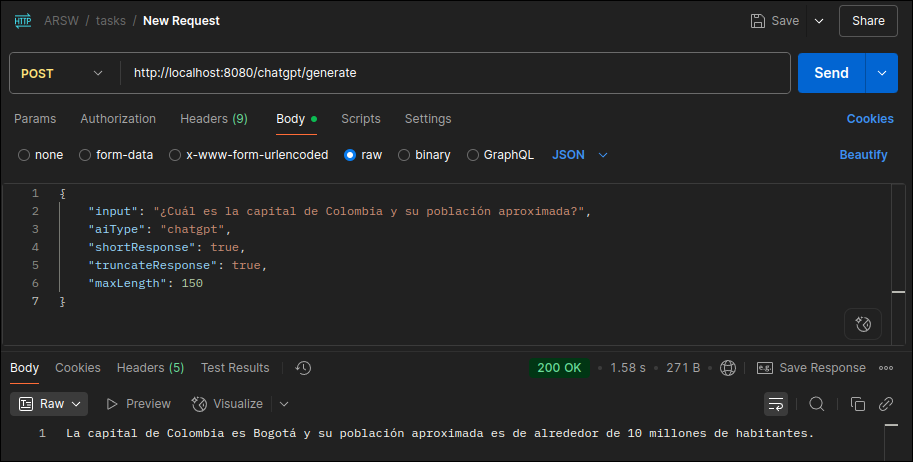
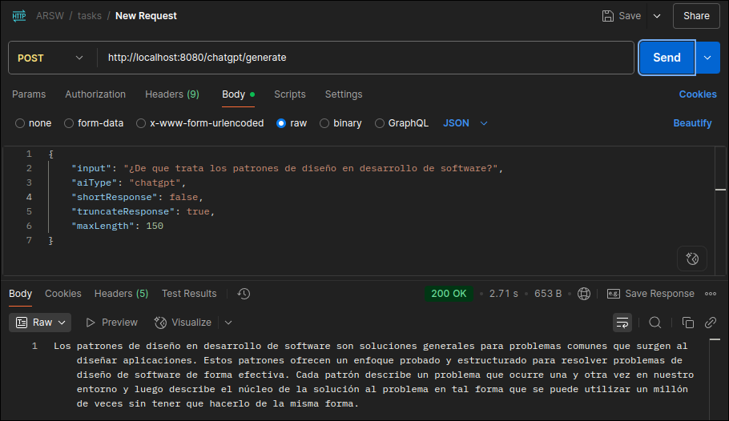

AI Integration Service

Application for interacting with Generative AI models like ChatGPT or Copilot, focusing on efficient resource utilization and flexible response processing through the application of design patterns.

## 🚀 How it Works

This service acts as an intermediary between client applications and various AI models (currently ChatGPT and GitHub Copilot). It intelligently routes user queries, processes inputs, applies dynamic transformations to AI responses, and ensures efficient resource management.

</br>
</br>

## ✨ Features

- AI Model Integration: Seamlessly connect with different AI providers.
- Intelligent Routing: Directs requests to appropriate AI models based on input type.
- Input Pre-processing: Cleans and enhances user input before sending it to the AI.
- Dynamic Response Decoration: Allows for on-the-fly modification of AI responses.
- Resource Optimization: Employs strategies to reduce unnecessary calls to external AI APIs.

</br>
</br>

## 📐 Design Patterns Used

This project leverages several fundamental design patterns to ensure maintainability, scalability, and code quality:

- Decorator Pattern: Dynamically adds functionalities to AI responses (e.g., truncating, formatting, or adjusting conciseness) without altering the core AI adapter logic. This allows for flexible and combinable post-processing.
- Independent Components Pattern: Achieved through an abstract adapter scheme (IAiAdapter). This design allows for adding new AI controllers (e.g., for Bard, Llama) with minimal code changes, making the system highly scalable and maintainable.
- Adapter Pattern: Works in conjunction with Independent Components. It standardizes the integration of different AI tools by providing a common functional contract (IAiAdapter). Each AI controller (like ChatGPTController or CopilotController) is wrapped by an adapter, ensuring they conform to the application's interface requirements.
- Two-Phase Predictions Pattern: Implemented on the frontend (client-side application), where a JavaScript module performs a preliminary validation of user input. This module uses a predefined dataset to answer trivial questions with pre-programmed responses, optimizing resource usage by reducing calls to the more expensive external AI APIs.

</br>
</br>

## 🛠️ Getting Started

Prerequisites:

* Java 17 or higher
* Maven or Gradle
* Git

Installation

```sh
combinablelone the repository:
git clone https://github.com/Andr3xDev/ARSW-ChatGPT.git 
cd your-ai-integration-project
```

Configure API Keys and Endpoints:

Create an application.properties file in src/main/resources/ with the following config:

- For OpenAI (ChatGPT)
    
    api.chatgpt.key=${OPENAI_API_KEY}
    api.chatgpt.url=${OPENAI_API_URL:https://api.openai.com/v1/chat/completions}

- For GitHub Copilot (Azure OpenAI) - if applicable, otherwise remove
    api.copilot.key=${AZURE_COPILOT_API_KEY}
    api.copilot.url=${AZURE_COPILOT_API_URL}


Running the Application

Use Maven to build and run the Spring Boot application:

```sh
mvn spring-boot:run
```

The application will typically start on http://localhost:8080.


</br>
</br>

## 🚀 Usage Examples

You can interact with the API using tools like Postman, curl, or any HTTP client.
Endpoint

- Request structure

```sh
{
    "input": <pront>,
    "aiType": <model>,
    "shortResponse": <boolean>,
    "truncateResponse": <boolean>,
    "maxLength": <int>
}
```

- Expected Response: STRING




